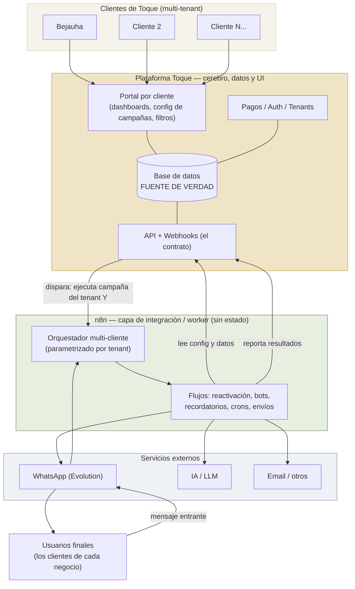
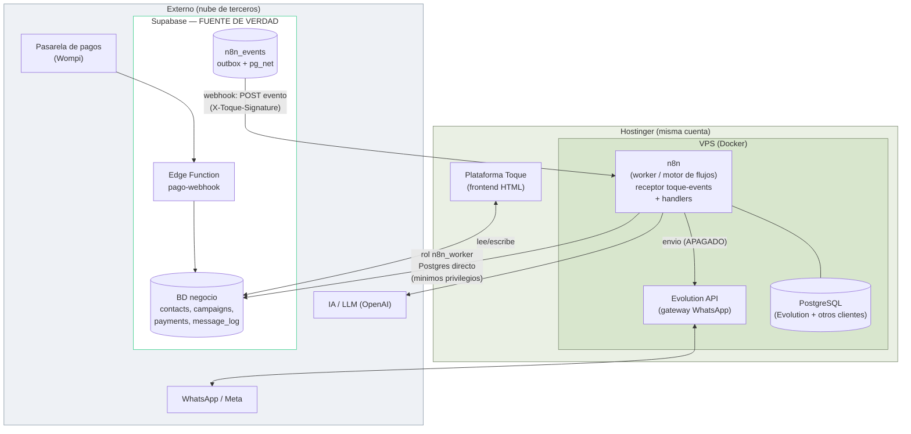

# Toque — Arquitectura objetivo (multi-cliente)

> Cómo debería funcionar Toque para Bejauha y para cualquier servicio que llegue después.
> **Este documento es a nivel Toque** (no solo Bejauha); vive aquí por ahora, puede reubicarse.

## Vista de infraestructura — dónde vive cada cosa

Las mismas piezas por ubicación (VPS Hostinger vs externo).

> Plataforma Toque = frontend **HTML** en Hostinger (misma cuenta del VPS). Fuente de verdad = **Supabase** (BD + API + Auth). **Contrato con n8n:** la plataforma encola en el outbox `n8n_events` y un **Database Webhook (pg_net)** dispara el **receptor** de n8n; n8n lee/escribe con el rol **`n8n_worker`** (mínimos privilegios, Postgres directo, sin DELETE). Los pagos entran por la **Edge Function `pago-webhook`** (Wompi). **Envíos WhatsApp apagados** hasta el go-live.

## Las 3 reglas de oro
1. **La plataforma es dueña de los datos.** La BD de Toque es la única fuente de verdad; ni n8n ni un Sheet guardan el estado del negocio.
2. **n8n es un worker sin estado.** Solo integra y ejecuta (WhatsApp, IA, crons, envíos). La plataforma lo dispara; él reporta de vuelta.
3. **Se hablan por un contrato.** API + webhooks entre plataforma y n8n. Nada de bases compartidas ni lógica duplicada.

## Notas
- **Escala:** el mismo motor de n8n sirve a todos los clientes de Toque. Sumar un cliente = configurarlo en la plataforma, no rehacer flujos.
- **Estado (2026-07-09):** Bejauha **migrado a Supabase** (Sheet cerrado). Admin, inbound, campañas, pago fallido y recordatorio corren sobre Supabase vía rol **`n8n_worker` (mínimos privilegios, Postgres directo, `maxConnections=4`)**. **Campañas programadas** con Opción A (plataforma agenda y dispara a la hora; n8n envía al recibir + candado de frescura de 2h). **Sandbox** (`test:true` → `test_messages`) con ruteo por rol cliente/admin. **Envíos WhatsApp apagados** hasta el go-live. Detalle técnico: [contrato-n8n.md](contrato-n8n.md) · estado: [estado-mvp.md](estado-mvp.md).
