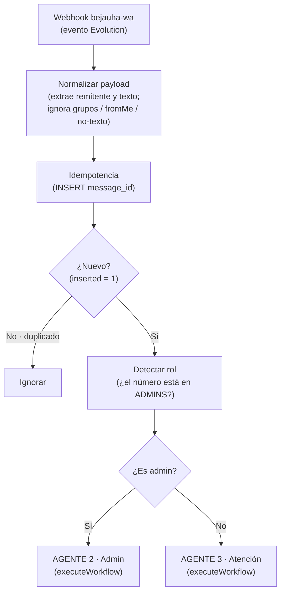
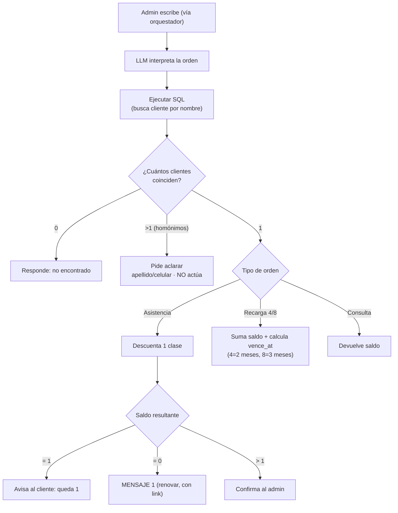
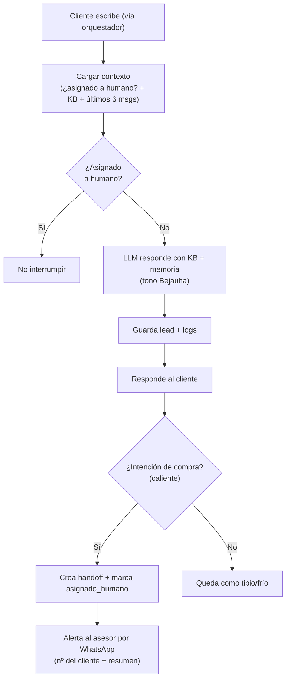
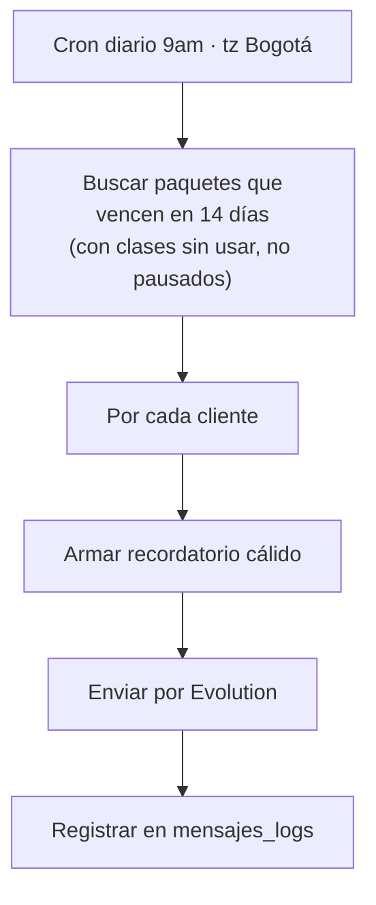

# Bejauha — Diagramas de flujo de los agentes

> Diagramas en Mermaid (vista previa de Markdown en VSCode o GitHub).
> Reflejan el estado real al **2026-05-26**. IDs en n8n:
> Orquestador `rD794jC4vc9C1Ke7` · Agente 2 `sILA5Co9FD3JI5eJ` ·
> Agente 3 `rctOPl2BpQ4UVjEk` · WF04 `SRCYX5c8qImyTYt9`.

---

## 0. Orquestador (WF00) — entrada + ruteo

Dos líneas de WhatsApp:
- **Línea dedicada** (futura) → solo Agente 1 (outbound).
- **Línea principal Bejauha (312 2011349)** → este orquestador → Agente 2 o 3.



---

## 1. Agente 1 — Filtrado y Prospección (Outbound) · ⏳ pendiente

> Aún no construido (espera definir la oferta para los 1.300).

```mermaid
flowchart TD
  C["Cron diario · tz America/Bogota"] --> W{"Warm-up (5→10→20/día)"}
  W --> SEL["Seleccionar lote de leads<br/>estado = pendiente"]
  SEL --> SEND["Enviar mensaje (copy rotado)<br/>por la LÍNEA DEDICADA"]
  SEND --> RESP{"¿Responde?"}
  RESP -->|No (72h)| SR["estado = sin_respuesta"]
  RESP -->|Sí| CLA["LLM clasifica"]
  CLA --> T{"Temperatura"}
  T -->|Caliente| H["Handoff + alerta a humano"]
  T -->|"Tibio / Frío"| BD["Queda en BD (seguimiento)"]
```

---

## 2. Agente 2 — Admin / Control de Clases ✅



---

## 3. Agente 3 — Atención / Inbound ✅



---

## 4. WF04 — Recordatorios de vencimiento (cron) ✅


