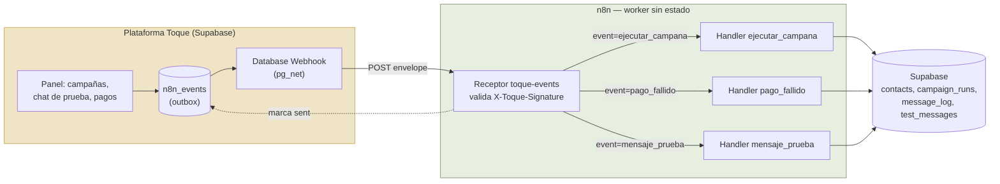
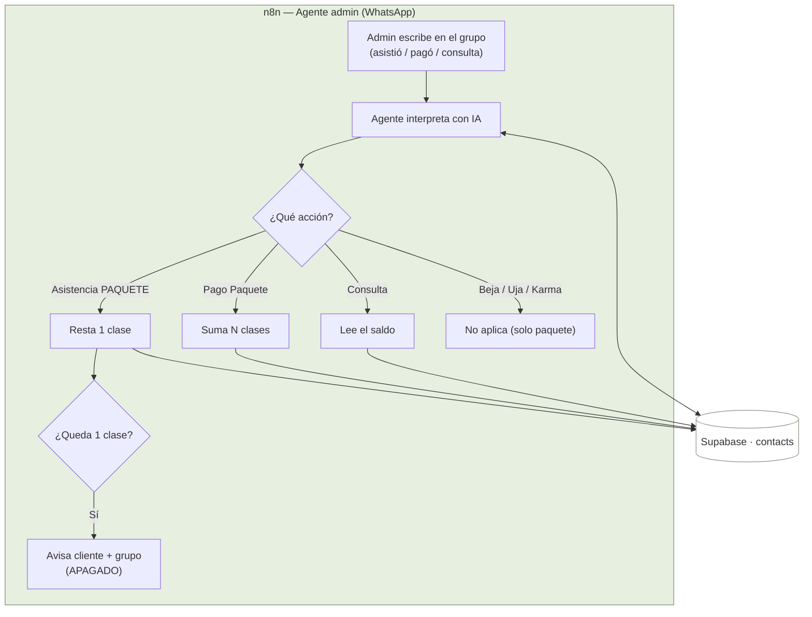
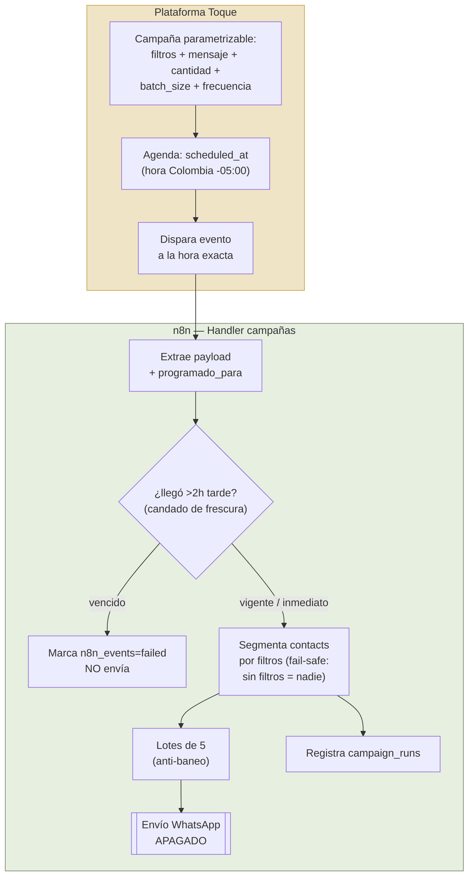
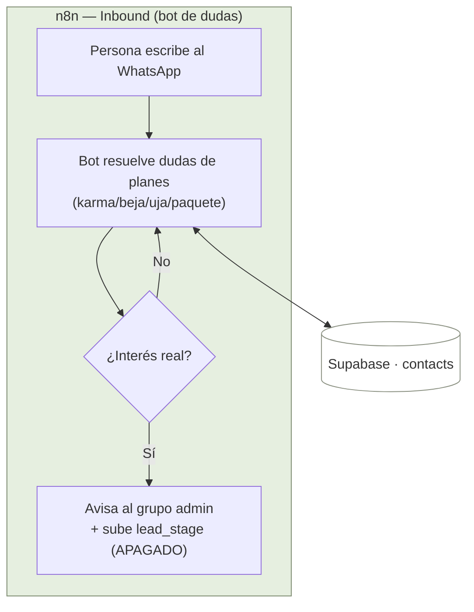
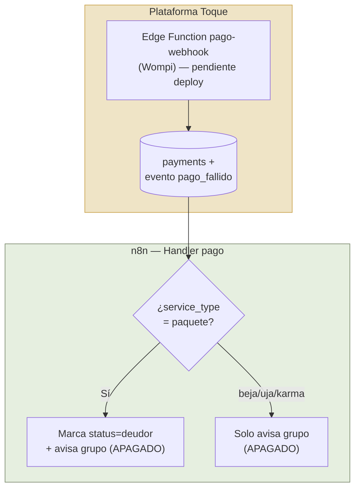
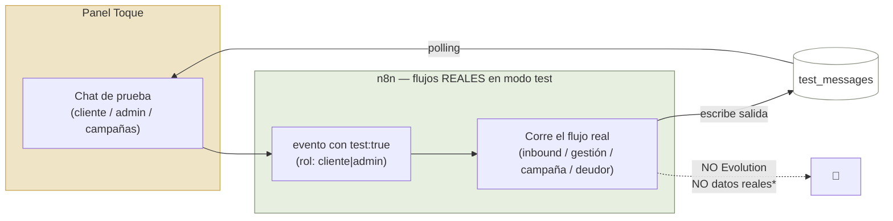

# Bejauha — Diagramas de flujo del MVP

> Actualizado 2026-07-09. Fuente única de datos: **Supabase** (plataforma Toque). Envíos por **Evolution (WhatsApp)**.
>
> **Reparto:** lo que toca WhatsApp + IA + envíos → **n8n (worker sin estado)**. Interfaz, configuración, pagos, agendamiento y dashboards → **plataforma Toque**. Se comunican por un **contrato**: outbox `n8n_events` + webhook → receptor n8n, y n8n lee/escribe Supabase con el rol **`n8n_worker`** (mínimos privilegios). Detalle en [contrato-n8n.md](contrato-n8n.md).
>
> ⚠️ **Todos los envíos de WhatsApp están APAGADOS** (blindados) hasta el go-live controlado.

---

## Modelo de datos (resumen)

- **Tipos de servicio:** `karma` (sin pago / a reactivar) · `beja` (suscripción normal) · `uja` (premium, domingos permanentes) · `paquete` (único con saldo de clases + `fecha_renovacion` + estado deudor).
- **Solo `paquete`** descuenta clases (`clases_restantes`).
- **Estados:** activo · no_activo · prospecto · deudor (solo paquete) · embajador. **`lead_stage`:** cliente · caliente · tibio · frio.

---

## 0) Puente de eventos — cómo se comunican plataforma y n8n

---

## 1) Flujo PAQUETES — gestión de clases (agente admin)

---

## 2) Flujo CAMPAÑAS — reactivación (`ejecutar_campana`, Opción A)

> **Opción A:** la plataforma es el reloj (agenda, calcula hora Colombia, dispara a la hora). n8n = "1 evento = 1 envío", sin Wait ni crons. **Frecuencia** (`una_vez`/`diaria`/`semanal`) = la plataforma re-emite un evento por ocurrencia. **Candado de frescura:** si `programado_para` llegó >2h tarde (n8n caído), no envía y marca el evento.

---

## 3) Flujo INBOUND — bot de dudas

---

## 4) Flujo PAGO FALLIDO — deudor (`pago_fallido`)

---

## 5) SANDBOX — modo prueba (`test:true`, sin WhatsApp)

> \* La **única** escritura permitida en modo test es el saldo del **contacto de prueba** `+573000000001` (para ver recarga→consulta encadenadas). Cualquier contacto real se **simula sin escribir**.

---

### Notas

- **Reparto:** WhatsApp + IA + envíos → **n8n** (verde). Interfaz, configuración, pagos, **agendamiento** y dashboards → **plataforma Toque** (dorado). Contrato = outbox `n8n_events` + webhook al receptor; n8n escribe con rol `n8n_worker` (mínimos privilegios, sin DELETE).
- **Admin:** solo consultar, gestionar asistencias y cargar clases de **paquetes** (no crea leads).
- **Inbound:** resuelve dudas y avisa al grupo cuando hay interés real (no redirige a URL).
- **Envíos apagados:** todos los nodos de envío WhatsApp están físicamente desactivados hasta el go-live (encendido flujo por flujo + warm-up).
